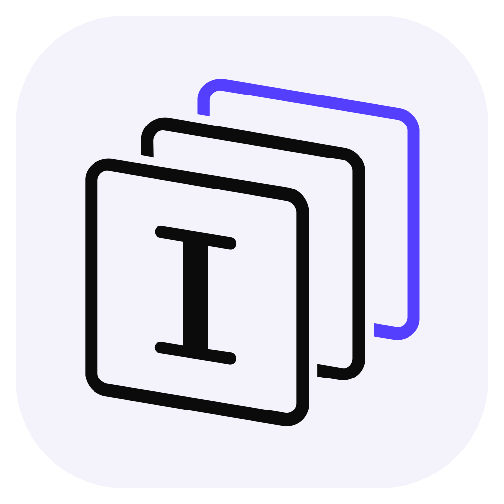
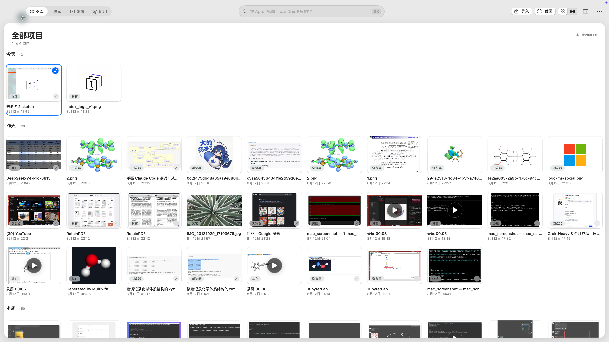
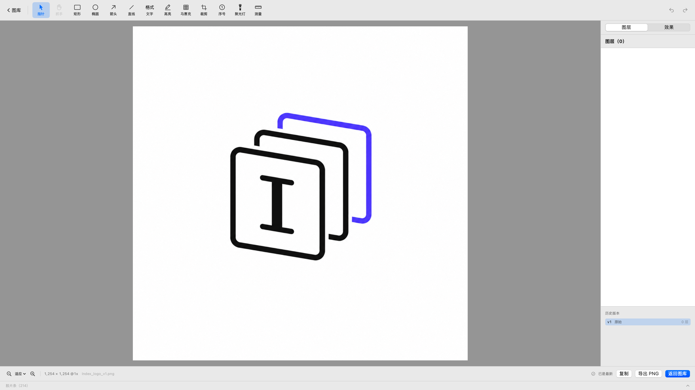
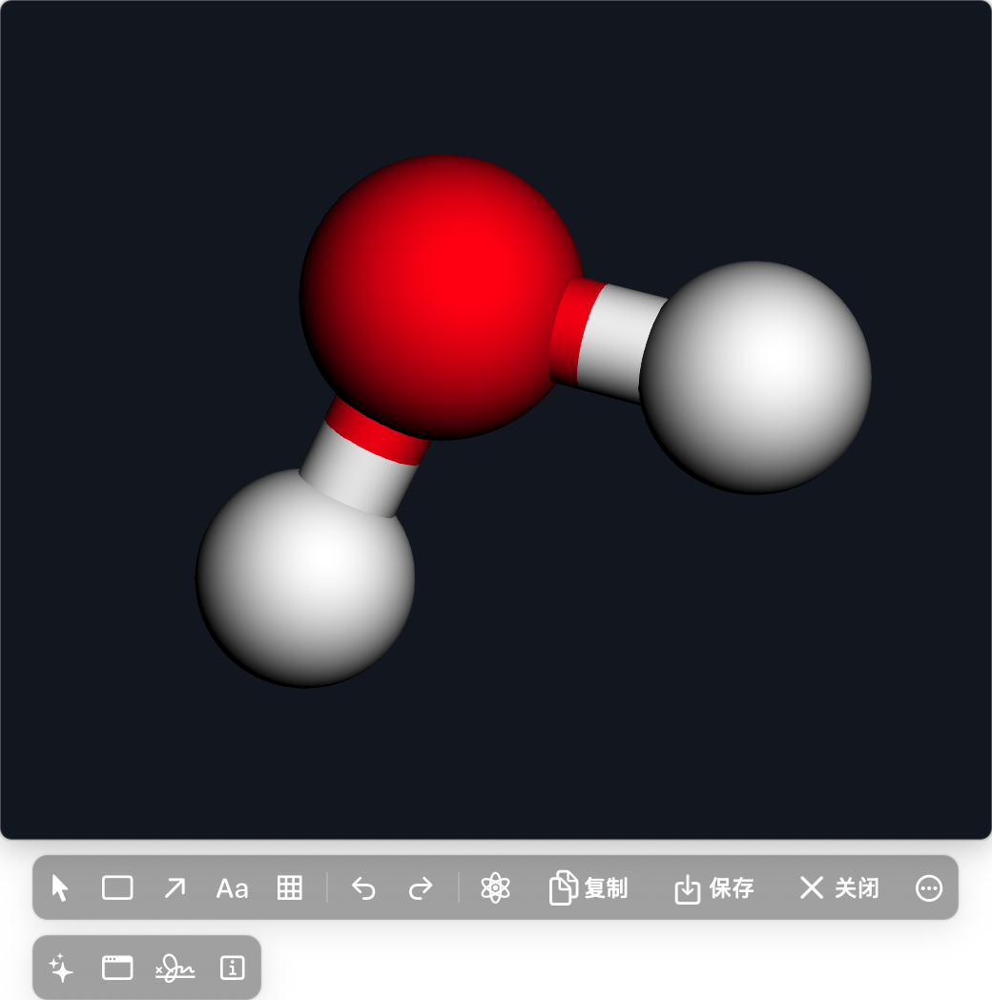
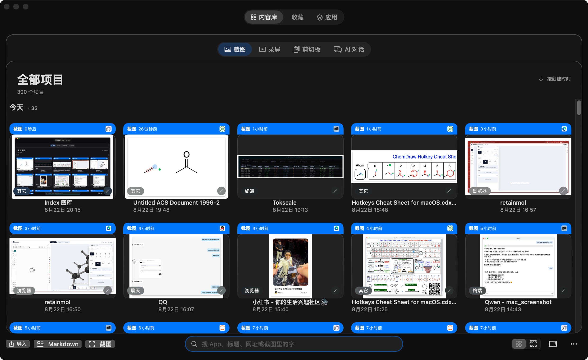
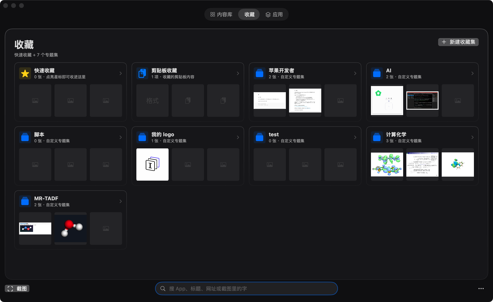
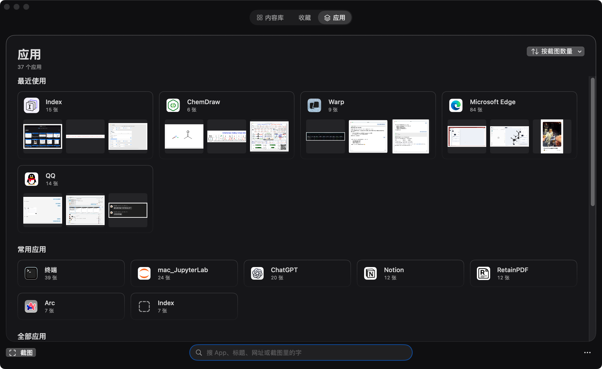
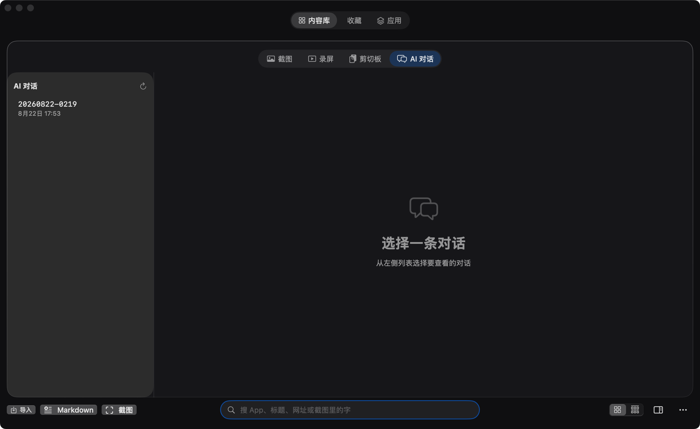

<p align="center">
  
</p>

<h1 align="center">Index</h1>

<p align="center">macOS 原生截图、标注与本地优先图片资料库，内置 AI Agent。</p>

<p align="center">
  
</p>

<p align="center"><b>冻结屏幕 → 框选 → Tool Palette 标注 → 复制 / 保存 / 钉图 / 上传</b></p>

## 特色功能

<table>
  <tr>
    <td width="68%"><br><b>统一 Tool Palette</b> — 截图、钉图和图库编辑器共用同一套标注工具；原图不变，修订可回溯。</td>
    <td width="32%"><br><b>3D 分子钉图</b> — 复制 XYZ，旋转到合适视角后定格、标注、复制或保存，同时保留原始坐标。</td>
  </tr>
</table>

- **冻结截图**：多显示器画面一次冻结，框选与标注始终对应同一帧。
- **内容库**：截图、录屏、剪切板、AI 对话统一入口，子 tab 切换，支持 OCR、标签、收藏与搜索。
- **AI Agent**：⌘⇧A 呼出，自然语言搜索截图、打开图片、管理插件、修改配置，对话历史持久化可回溯。
- **结构化剪贴板**：复制颜色、URL、文本、图片，粘贴时自动识别类型。
- **非破坏性编辑**：原图不可变，标注保存为结构化图层和修订历史。
- **快速输出**：钉图、复制、保存、上传和拖拽暂存走同一套动作。
- **化学工作流**：`复制 XYZ → ⌃⌘M → 旋转 → 定格 → 标注 → 输出`。

## 工作区

<table>
  <tr>
    <td width="50%"><br><b>内容库</b> — 截图 / 录屏 / 剪切板 / AI 对话，子 tab 切换。</td>
    <td width="50%"><br><b>专题集</b> — 手动分组，跨来源组织内容。</td>
  </tr>
  <tr>
    <td width="50%"><br><b>应用</b> — 按来源 App 浏览截图。</td>
    <td width="50%"><br><b>AI 对话</b> — 自然语言搜索截图、打开图片、管理插件，历史持久化。</td>
  </tr>
</table>

全部图片均来自正在运行的 Index，不是界面设计稿。

## 构建

要求 macOS 14+ 与 Xcode Command Line Tools。

```bash
./scripts/make-dev-cert.sh   # 首次构建执行一次
./build.sh release
open build/Index.app
```

首次截图前，在"系统设置 → 隐私与安全性 → 屏幕录制"中允许 Index，然后重新打开 App。

默认快捷键：截图 `⌃⌘A` · 滚动截图 `⌃⌘S` · 录屏 `⌃⌘R` · 图库 `⌃⌘G` · AI Agent `⌘⇧A` · 3D 分子 `⌃⌘M`。

开发检查：`./scripts/check.sh`

版本附件见 [GitHub Releases](https://github.com/wxyhgk/index/releases)；当前 CI 构建为未公证预览版。

SwiftPM target、可执行文件、Bundle ID 和 `~/Library/Application Support/Index/` 仍保留内部名称，
以兼容既有授权与数据；用户看到的 App bundle 与显示名称均为 Index。

## 文档与许可

[架构](ARCHITECTURE.md) · [隐私](PRIVACY.md) · [安全](SECURITY.md) · [第三方声明](THIRD_PARTY_NOTICES.md) · [CI](docs/ci.md)

[GNU General Public License v3.0 or later](LICENSE)（`GPL-3.0-or-later`）。
